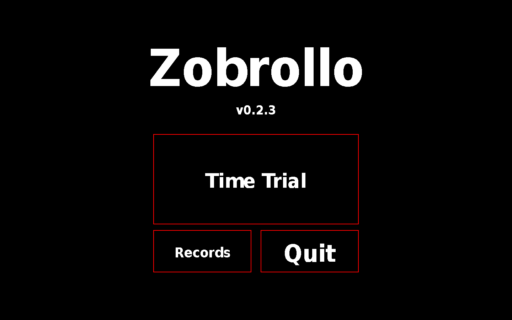

# Zobrollo
Zobrollo is a 2d minimalistic top-view racing game programmed in C using the <a href="https://liballeg.org">Allegro</a> library. At this point of development you can only play in time trial.

# How to build
You first need to build the source code. This program uses the Allegro library so make sure that you have allegro installed.
Go to the directory of the source cod and run:
```shell
make
```
This should build the program and create the file `zobrollo`. At the moment Zobrollo is only supported for UNIX this I intend to change in the future.
# How to run
On UNIX-like operating systems use;
```shell
./zobrollo
```
This should start the game. You should keep the file `zobrollo` in this directory as this is also the place where the tracks and sprites that the program uses are stored.

# Controls
`UP`		Accelerate
`DOWN`		Break
`LEFT`		Steer left
`RIGHT`		Steer right

`ESCAPE`	Go back to main menu
`F11`		Toggle full screen

# License
This program is licensed under GPLv3.

# Contact
If you are in any trouble don't hesitate to send me an e-mail:<a href="mailto:thomas.v.maaren@outlook.com">thomas.v.maaren@outlook.com</a>. I probably have too much free time anyway.

# To-do list
<ol>
	<li>Windows support.</li>
	<li>Be able to view records from a graphical interface.</li>
	<li>Be able to store, replay and race against ghosts from a graphical interface.</li>
	<li>Add more tracks.</li>
	<li>Be able to change controls in config file</li>
	<li>Be able to race against each other on a local network. I already have a working test for this I just haven't properly implemented it yet.</li>
	<li>Be able to race with anyone in the world. For this I will need to write server-side software.</li>
	<li>A settings menu.</li>
</ol>

# Screenshots

The main menu

The example track

The Long Straight track

